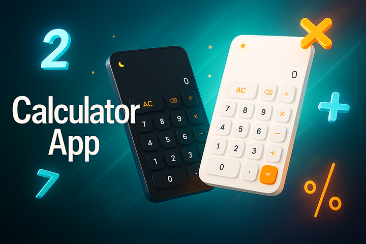

# Desktop and Web Calculator

A sleek, responsive calculator web application built with vanilla JavaScript, HTML, and CSS, packaged with Electron for Windows desktop use.

## ✨ Features

- **Basic Operations**: Addition, subtraction, multiplication, and division
- **Other Features**:
  - Clear all functions
- **Keyboard Support**: Full keyboard accessibility
- **Modern UI**: Clean, animated interface with theme support (light/dark)
- **Error Handling**: Graceful handling of edge cases (e.g., division by zero)

## 📸 Preview

<p align="center">
  
</p>

## 🚀 Getting Started

### Prerequisites

- Node.js 16+ (LTS recommended)
- npm (comes with Node.js)

### Install & Run (Development)

```bash
git clone https://github.com/Dieg0DH/Calculator.git
cd Calculator
npm install
npm start
```

This launches the Electron app. You can also open public/calculator.html directly in a browser for the web version.
Build Desktop App (Production)

```Bash

npm run dist
```

The packaged executables (Windows .exe) will be generated in the dist/ folder. Or just download the (.exe) bellow:

## 📥 Download

  []

<details>
  <summary><strong>🖥️ Usage Tips</strong></summary>

  <br>
  🎹 Click buttons or use your keyboard for fast input.

  <ul>
    <li>Use the number buttons (0–9) to input numbers</li>
    <li>Use <kbd>+</kbd>, <kbd>-</kbd>, <kbd>*</kbd>, <kbd>/</kbd> for basic arithmetic</li>
    <li>Press <kbd>=</kbd> or <kbd>Enter</kbd> to see the result</li>
    <li>Press <kbd>Backspace</kbd> to delete the last digit</li>
    <li>Press <kbd>AC</kbd> or <kbd>Escape</kbd> to clear all</li>
  </ul>
</details>


<details>
  <summary><strong>🏗️ Project Structure</strong></summary>

  <br>

  ```text
  Calculator/
  ├── 📁 Calculator/
  │   ├── 📁 src/
  │   │   ├── 📁 assets/
  │   │   │   └── 📁 styles/
  │   │   │       ├── 📄 reset.css
  │   │   │       ├── 📄 calculator.css
  │   │   │       └── 📁 font/
  │   │   │           ├── 📁 css/
  │   │   │           └── 📁 webfonts/
  │   │
  │   │   └── 📁 js/
  │   │       ├── 📄 app.js
  │   │       ├── 📄 calculator.js
  │   │       ├── 📄 ui.js
  │   │       ├── 📄 constants.js
  │   │       ├── 📄 theme.js
  │   │       └── 📁 utils/
  │   │           └── 📄 utils.js
  │   │
  │   └── 📁 public/
  │       ├── 📄 calculator.html
  │       ├── 🖼️ favicon.ico
  │       └── 🖼️ image.png
  │
  ├── 📄 .gitignore
  ├── 📄 main.js
  ├── 📄 package.json
  └── 📄 README.md
